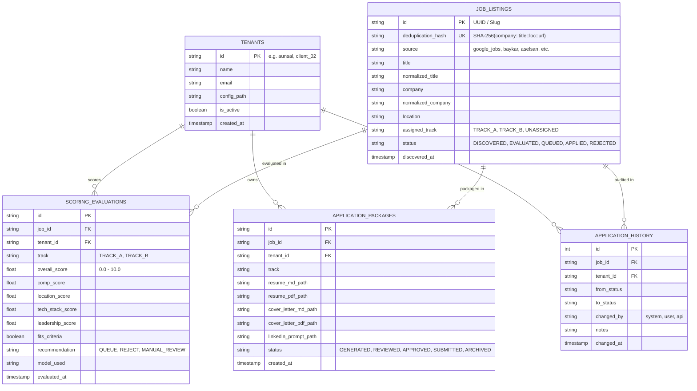

# Multi-Tenant Architecture Blueprint: Career Engine & Autonomous Sourcing SaaS

> **Author:** Ahmet Halit Ünsal / Career Engine Architecture  
> **Platform Version:** `0.2.0` (Production Hardened)  
> **Target Environment:** Host `vsmlnx` (Single-Node Stage) $\rightarrow$ Distributed Cloud SaaS (Production Stage)  
> **Status:** Authoritative Design Specification

---

## 1. Executive Summary & SaaS Transformation Vision

The **Career Engine** is an autonomous sourcing, fit-scoring, and application drafting orchestrator. Initially engineered as a personal dual-track career accelerator (Track A: Embedded Software Leadership; Track B: Quantitative Engineering & Algorithmic Trading), its decoupled modular architecture is intentionally designed for rapid conversion into a multi-tenant **Career-as-a-Service (CaaS)** or B2B/B2C SaaS platform.

```
+---------------------------------------------------------------------------------------------------+
|                                  CARRIER ENGINE ARCHITECTURAL TOPOLOGY                            |
+---------------------------------------------------------------------------------------------------+
                                                  |
           +--------------------------------------+--------------------------------------+
           |                                                                             |
           v                                                                             v
+-----------------------------+                                               +-----------------------------+
|   GLOBAL INGESTION POOL     |                                               |     MULTI-TENANT LAYER      |
|  (Deduplicated Scrapers)    |                                               |  (Profiles & Isolated Data) |
+-----------------------------+                                               +-----------------------------+
| • Google Jobs / SerpApi     |                                               | • Tenant A (aunsal)         |
| • LinkedIn Apify Scraper    |                                               |   - Dual-Track Profile      |
| • Baykar, Aselsan, TUSAŞ    |                                               |   - Custom Prompt Jinja2    |
| • Roketsan, Vizyoner Genç   |                                               |   - Isolated /inbox/        |
+-----------------------------+                                               | • Tenant B (Embedded Dev)   |
           |                                                                  | • Tenant C (Quant Analyst)  |
           | SHA-256 Hash Idempotency                                         +-----------------------------+
           v                                                                                 |
+-------------------------------------------------------------------------------------+      |
|                               CENTRAL DATA LAYER                                    |      |
|   SQLite (WAL Mode) on vsmlnx  -->  PostgreSQL + Row-Level Security (RLS) in Cloud  |<-----+
+-------------------------------------------------------------------------------------+
                                                  |
                                                  v
+---------------------------------------------------------------------------------------------------+
|                                  WORKER & EVALUATION PIPELINE                                     |
|  1. Global Scrape  -->  2. Tenant Iteration  -->  3. LLM Fit Scoring  -->  4. Package Staging     |
+---------------------------------------------------------------------------------------------------+
                                                  |
                                                  v
+---------------------------------------------------------------------------------------------------+
|                               HUMAN-IN-THE-LOOP APPROVAL GATE                                     |
|       Staged PDFs in /inbox/<tenant_id>/  -->  Web UI / Telegram Bot  -->  One-Click Submission    |
+---------------------------------------------------------------------------------------------------+
```

---

## 2. Tenant Isolation & Directory Topology

To ensure zero cross-contamination of candidate data, compensation expectations, proprietary source CVs, and generated application packages, the file system and configuration layers adhere to a strict tenant-isolated hierarchy.

### 2.1 File System Hierarchy

```
career-engine/
├── config/
│   ├── config.yaml                    # Global engine, database, and scraper settings
│   └── tenants/
│       ├── aunsal/                    # Tenant 1 (Default / Root User)
│       │   ├── profile.yaml           # Dual-track definitions, comp baseline, locations
│       │   ├── prompts/               # Custom system and generation prompts
│       │   │   ├── scoring.j2         # LLM evaluation rubric template
│       │   │   ├── resume.j2          # ATS-tailored resume generation template
│       │   │   └── cover_letter.j2    # Cover letter synthesis template
│       │   └── sources/               # Authoritative Markdown sources of truth
│       │       ├── Experience.md      # Full career trajectory
│       │       ├── Education.md       # Degrees, honors, patents
│       │       └── Toolbox.md         # Skills and tech taxonomy
│       ├── tenant_dev_002/            # Tenant 2 (Example Client)
│       │   ├── profile.yaml
│       │   ├── prompts/
│       │   └── sources/
│       └── ...
├── data/
│   └── career_engine.db               # SQLite database with tenant-scoped tables
└── inbox/                             # Staging directory for Human-in-the-Loop review
    ├── aunsal/                        # Isolated inbox per tenant
    │   ├── baykar_gomulu_lideri_4f8a12bc/
    │   │   ├── Resume_Ahmet_Halit_Unsal_baykar.md
    │   │   ├── Resume_Ahmet_Halit_Unsal_baykar.pdf
    │   │   ├── Cover_Letter_Ahmet_Halit_Unsal_baykar.md
    │   │   ├── Cover_Letter_Ahmet_Halit_Unsal_baykar.pdf
    │   │   └── LinkedIn_Guidance_baykar.md
    │   └── aselsan_lead_architect_9a7d31ef/
    └── tenant_dev_002/
        └── ...
```

### 2.2 Tenant Profile Schema Specification (`profile.yaml`)

Each tenant profile is validated against Pydantic V2 schemas (`TenantProfile` in `src/config.py`):

```yaml
tenant_id: "aunsal"
name: "Ahmet Halit Ünsal"
email: "ahmethalitunsal@gmail.com"
phone: "+90-5XX-XXX-XXXX"
location_current: "Ankara, Turkey"

links:
  website: "https://www.ahmethalitunsal.com"
  github: "https://github.com/aunsal89"
  linkedin: "https://www.linkedin.com/in/aunsal/"
  aura_showcase: "https://www.auratrading.org"
  edutrace_showcase: "https://edutrace.net"

sources_of_truth:
  cv_markdown: "config/tenants/aunsal/sources/Experience.md"
  education_markdown: "config/tenants/aunsal/sources/Education.md"
  skills_toolbox: "config/tenants/aunsal/sources/Toolbox.md"

tracks:
  track_a:
    name: "Embedded Software Leadership / Directorship"
    enabled: true
    target_titles:
      - "Embedded Software Lead"
      - "Director of Embedded Systems"
      - "Software Engineering Manager"
      - "Chief Software Architect"
    target_sectors:
      - "Defense Electronics"
      - "Automotive Powertrain & EV"
    target_locations:
      - "Istanbul, Turkey"
      - "Ankara, Turkey"
    compensation:
      min_monthly_net_usd: 8600.0
      currency: "USD"
      period: "monthly"
      type: "net_inflation_hedged"
    experience_requirements:
      min_total_years: 15
      min_leadership_years: 8
      max_team_size_managed: 30
    core_competencies:
      - "MBD (MATLAB/Simulink/Stateflow)"
      - "ISO 26262 (ASIL D), ASPICE, UN R155/R156 CSMS"
      - "PMSM/IPMSM Motor Control, Inverters, OBC, BMS"
      - "AUTOSAR BSW/ASW, FreeRTOS, C/C++ Bare-Metal"
    exclusions:
      - "Junior/Mid-level pure coding without architecture"
      - "Web frontend or purely non-technical administrative"

  track_b:
    name: "Quantitative Developer / Algorithmic Trading"
    enabled: true
    target_titles:
      - "Quantitative Developer"
      - "Algorithmic Execution Engineer"
      - "High-Frequency Trading C++ Developer"
    target_regions:
      - "Europe"
      - "APAC"
      - "China"
    excluded_regions:
      - "United States"
    core_competencies:
      - "AURA Algorithmic Engine Architecture"
      - "CCXT, Python, C++, pandas, NumPy"
      - "Walk-forward optimization, successive halving, multi-layer risk"

generation_preferences:
  tailored_cv_format: "markdown_and_pdf"
  cover_letter_format: "markdown_and_pdf"
  staging_inbox: "inbox/aunsal"
  tone: "Executive, Highly Competent, Metric-Driven, Direct"
```

---

## 3. State Management & Database Isolation Architecture

The core data architectural principle is **Global Ingestion Deduplication with Tenant-Scoped Application Lifecycle**.



### 3.1 Separation of Shared vs Tenant-Private Data

1. **Shared Global Pool (`job_listings`):**
   * Sourcing scrapers only run **once** per target feed across all tenants.
   * Jobs are hashed via `generate_deduplication_hash(company, title, location, url)`.
   * Multiple scrapers discovering the exact same job update the single master record without duplicate entries.
2. **Tenant-Partitioned Evaluations (`scoring_evaluations`):**
   * A single job listing can be evaluated simultaneously for Tenant A (as an ASIL D Embedded Lead, Score: 9.2 $\rightarrow$ QUEUE) and Tenant B (as a Quant Dev, Score: 2.1 $\rightarrow$ REJECT).
   * Unique constraint on `(job_id, tenant_id)` guarantees one evaluation per candidate per job.
3. **Tenant-Partitioned Packages & Audit History (`application_packages`, `application_history`):**
   * Resumes and Cover Letters are staged into `inbox/<tenant_id>/`.
   * Transitions (`QUEUED` $\rightarrow$ `APPLIED`) are logged with `changed_by` and `tenant_id`.

### 3.2 Scaling Database Models (SaaS Progression)

| Dimension | Stage 1 (Host `vsmlnx` CLI) | Stage 2 (Multi-Tenant Node) | Stage 3 (Enterprise Cloud SaaS) |
| :--- | :--- | :--- | :--- |
| **Engine** | SQLite 3 (WAL Mode, Foreign Keys) | PostgreSQL 16 (Single DB, RLS) | PostgreSQL on AWS Aurora / Neon (Serverless) |
| **Isolation** | Shared SQLite file with `tenant_id` foreign keys | PostgreSQL Row-Level Security (`current_setting('app.tenant_id')`) | Tenant-isolated schemas or multi-cluster databases |
| **Query Engine** | In-process Python SQLite driver | AsyncPG / SQLAlchemy 2.0 Async | Prisma ORM / SeaORM + Redis caching |
| **Backups** | Automated filesystem snapshot of `data/` | Continuous WAL archiving + S3 point-in-time | Multi-region automated replication |

---

## 4. Worker Execution Engine & Distributed Task Processing

### 4.1 Execution Topology

The worker pipeline operates on a decoupled multi-phase architecture:

```mermaid
flowchart TD
    Timer[Systemd Timer / Cron / Celery Beat] -->|Trigger 08:00 AM| Orchestrator[Master Pipeline Orchestrator]
    
    subgraph Global Sourcing Phase
        Orchestrator --> ScraperMgr[SourcingManager]
        ScraperMgr --> Scraper1[Google Jobs / SerpApi]
        ScraperMgr --> Scraper2[LinkedIn Apify]
        ScraperMgr --> Scraper3[Defense Portals: Baykar/Aselsan/TUSAŞ]
        Scraper1 & Scraper2 & Scraper3 --> DedupPool[(Global Job Pool: SQLite / Postgres)]
    end
    
    subgraph Multi-Tenant Batch Phase
        DedupPool --> TenantLoop[Iterate Active Tenants]
        TenantLoop --> TenantA[Tenant: aunsal]
        TenantLoop --> TenantB[Tenant: client_02]
        
        subgraph Tenant A Processing
            TenantA --> ScorerA[LLM Fit Scorer]
            ScorerA --> ChainA[Fallback: Gemini -> Claude -> GPT-4o]
            ChainA --> FilterA{Score >= Threshold?}
            FilterA -->|Yes: QUEUE| DrafterA[Application Generator]
            FilterA -->|No: REJECT| LogA[Log Evaluation]
            DrafterA --> StageA[/inbox/aunsal/ Staged PDFs]
        end
        
        subgraph Tenant B Processing
            TenantB --> ScorerB[LLM Fit Scorer]
            ScorerB --> ChainB[Fallback: Gemini -> Claude -> GPT-4o]
            ChainB --> FilterB{Score >= Threshold?}
            FilterB -->|Yes: QUEUE| DrafterB[Application Generator]
            FilterB -->|No: REJECT| LogB[Log Evaluation]
            DrafterB --> StageB[/inbox/client_02/ Staged PDFs]
        end
    end
```

### 4.2 Worker Implementation Code (`src/cli.py` Multi-Tenant Runner)

```python
def cmd_pipeline(args: argparse.Namespace) -> None:
    """Execute end-to-end career sourcing, scoring, and application drafting pipeline."""
    config = load_engine_config()
    tenant_mgr = TenantManager(config)

    # Determine tenant execution list
    if getattr(args, "all_tenants", False):
        tenant_ids = tenant_mgr.list_available_tenants()
    elif getattr(args, "tenant_id", None):
        tenant_ids = [args.tenant_id]
    else:
        tenant_ids = [config.multi_tenancy.active_tenant]

    # Step 1: Ingest global listings across all scrapers (once)
    console.print("[bold blue]1. Running Global Multi-Channel Sourcing Pipeline...[/bold blue]")
    default_tenant = tenant_mgr.get_tenant(tenant_ids[0])
    sourcing_mgr = SourcingManager(config=config, tenant=default_tenant)
    sourcing_mgr.run_sourcing_pipeline(scraper_name=getattr(args, "scraper", None), dry_run=getattr(args, "dry_run", False))

    if getattr(args, "dry_run", False):
        return

    # Step 2: Iterate through tenants with strict isolation
    for tid in tenant_ids:
        tenant = tenant_mgr.get_tenant(tid)
        console.print(f"\n[bold yellow]>>> Evaluating Opportunities for Tenant: {tenant.name} ({tenant.tenant_id})[/bold yellow]")

        # Evaluate fit against tenant's dual-track criteria
        scorer = OpportunityScorer(config=config, tenant=tenant)
        evaluations = scorer.run_scoring_batch(auto_queue=True)

        # Draft ATS-tailored resumes and cover letters staged in /inbox/<tenant_id>/
        drafter = ApplicationGenerator(config=config, tenant=tenant)
        drafter.draft_queued_jobs()

    console.print("\n[bold green]✓ Multi-Tenant Pipeline Finished Successfully.[/bold green]")
```

### 4.3 Rate Limiting, Proxy Rotation & API Quota Budgeting

To scale to dozens of tenants without IP bans or excessive LLM costs:

1. **Proxy Rotation Pool:** Sourcing scrapers use an HTTP proxy pool (e.g., Bright Data / Oxylabs) with sticky sessions for regional portals (Baykar, Vizyoner Genç).
2. **Per-Tenant Token Quota:** Each tenant is allocated a monthly LLM token budget (e.g., 500,000 tokens for Pro Tier). Once consumed, scoring switches to local heuristic keyword filtering until quota refresh or top-up.
3. **Provider Fallback Resilience:** High-availability fallback chain:
   $$\text{Primary: Google Gemini 2.5 Pro} \longrightarrow \text{Fallback 1: Claude 3.7 Sonnet} \longrightarrow \text{Fallback 2: GPT-4o}$$

---

## 5. Human-in-the-Loop Safeguard & Application Lifecycle

The **Human-in-the-Loop (HITL)** architecture ensures autonomous precision without the risk of unsupervised or unverified application submissions.

```
[DISCOVERED]  -->  (Scoring Engine)  -->  [EVALUATED]  -->  (Fit Threshold Met)
      |                                                             |
      v                                                             v
 [REJECTED]                                                     [QUEUED]
                                                                    |
                                                      (Application Drafter)
                                                                    |
                                                                    v
                                                     [STAGED IN /inbox/<tenant>/]
                                                      • Resume.md / Resume.pdf
                                                      • Cover_Letter.md / PDF
                                                      • LinkedIn_Guidance.md
                                                                    |
                                                    +---------------+---------------+
                                                    |                               |
                                                    v                               v
                                           [APPROVED BY USER]              [REJECTED BY USER]
                                           `run.py approve <id>`          `run.py reject <id>`
                                                    |
                                                    v
                                                [APPLIED]
```

### 5.1 Staging Package Structure

Every queued job produces an isolated package in `/inbox/<tenant_id>/<company>_<title_slug>_<job_id>/`:
1. **`Resume_<Candidate>_<Company>.pdf`:** Cleanly rendered executive PDF styled with high-contrast typography, dual-column contact header, and emphasized leadership achievements.
2. **`Cover_Letter_<Candidate>_<Company>.pdf`:** Custom synthesized cover letter addressed to the specific company engineering leadership.
3. **`LinkedIn_Guidance.md`:** Tailored prompt for the user to optimize their LinkedIn headline/summary when networking with hiring managers.

### 5.2 Notification & Review Integrations

* **Telegram / Discord Bot Webhook:** When a new package is generated, a webhook posts a rich card containing:
  * Company Name, Title, and Track.
  * Fit Score (e.g., `9.4 / 10.0`), Salary Match, Location Compatibility.
  * Direct clickable link to download the generated PDF.
  * Quick-action buttons: `[Approve & Mark Applied]` | `[Reject]`.
* **Web UI Dashboard:** React 19 / Astro client interface listing active inbox packages with live PDF preview and inline text editing.

---

## 6. Commercialization Roadmap & SaaS Monetization

### 6.1 Subscription Tiers

| Feature | Free (Discovery) | Pro Candidate ($39 / mo) | Executive Managed ($149 / mo) |
| :--- | :---: | :---: | :---: |
| **Daily Sourcing Runs** | Daily (Google Jobs) | Daily (All 7+ Scrapers) | Continuous / Hourly |
| **Track Customization** | Single Track | Dual-Track (e.g. Embedded + Quant) | Unlimited Multi-Track |
| **LLM Fit Scoring** | Top 10 jobs/month | Unlimited jobs | Unlimited + Priority Fallback |
| **Tailored Resumes & Cover Letters** | 3 / month (Markdown only) | Unlimited (Markdown + High-Res PDF) | Unlimited + Custom LaTeX / PDF Themes |
| **Defense / Specialized Scrapers** | ❌ | ✅ (Baykar, Aselsan, TUSAŞ, etc.) | ✅ + Custom Company Feed Monitoring |
| **Telegram / Discord Instant Alerts** | ❌ | ✅ | ✅ + Dedicated Career Concierge |
| **Human-in-the-Loop Inbox** | Local CLI | Web Dashboard + CLI | Web Dashboard + Managed Review |

### 6.2 Stripe Billing & Account Provisioning

```
[User Signup / Checkout]
         |
         v
[Stripe Webhook: checkout.session.completed]
         |
         v
[FastAPI Provisioning Endpoint]
         ├── Create Database Record: INSERT INTO tenants (id, name, email, is_active)
         ├── Scaffold File Directory: config/tenants/<tenant_id>/
         ├── Generate Default profile.yaml from Onboarding Form
         └── Send Welcome Notification + Connect Staging Inbox
```

### 6.3 SaaS Rollout Milestones

* [x] **Milestone 1 (Current - Phase 5):** Single-node hardened architecture on `vsmlnx` with Conda `lnxenv`, `systemd` daily timer, and multi-tenant config schemas.
* [ ] **Milestone 2 (FastAPI & Web UI):** REST API wrapper over `JobRepository` and `SourcingManager`, Next.js/React web dashboard for `/inbox/` approvals.
* [ ] **Milestone 3 (PostgreSQL & Celery/Redis):** Transition SQLite to managed PostgreSQL with Row-Level Security and distributed Celery workers.
* [ ] **Milestone 4 (Commercial Launch):** Stripe billing integration, Telegram notification bot, and automated custom scraper onboarding.

---

## 7. Verification & Operational Directives

### 7.1 Multi-Tenant Verification Checklist
* [x] Schema supports multi-tenant isolation via `tenants`, `scoring_evaluations`, and `application_packages`.
* [x] Sourcing manager deduplicates globally while maintaining tenant evaluation independence.
* [x] Output packages are partitioned into tenant-specific subdirectories under `inbox/`.
* [x] All Python scripts strictly execute using `/home/nsl/miniconda3/envs/lnxenv/bin/python`.
